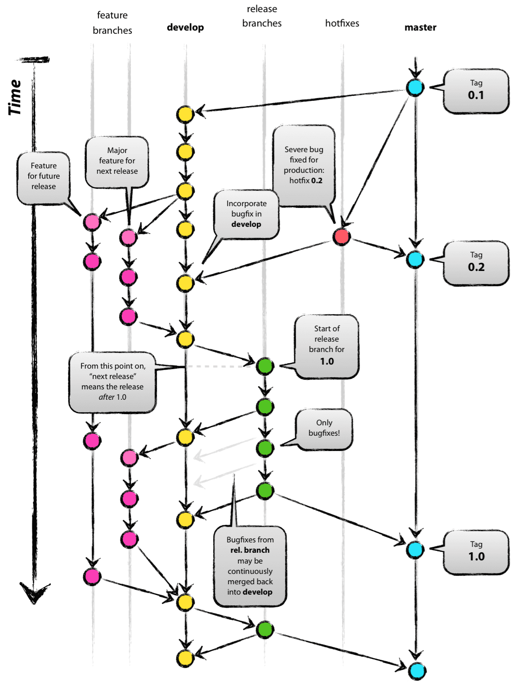

## Git Branch 종류 5가지
* ### 메인 브랜치 ( mater,develop)
* ### 보조 브랜치(feature, release, hotfix)
 
  

 #### gitblow 방법에서 사용하는 브랜치의 흐름

 1. ### Master Branch
  > * #### 배포 가능한 상테만을 관리
  
   

  2. ### Develop Branch 
 > * #### 다음 출 시 버전을 개발하는 브랜치 
  > * #### 기능 개발을 위한 브랜치들의 병합을 위해 사용, 즉 모든 기능 추가 이후 버그가 수정되고 배포 가능한 안정적인 상태라면 master 브랜치에 병합
  > * #### 평소엔 이 브랜치를 기반으로 개발을 진행  
   

 
   
3. ### Feature branch
> * #### 가능을 개발하는 브랜치로 새로운 기능 개발 및 버그 수정이 필요한 때마다 'develop' 브랜치로부터 분기함.
> * #### 로컬 저장소에서 관리 
> * #### 개발이 완료되면 'develop' 브랜치로 병합하여 다른 사람들과 공유
>> ##### feature 브랜치 이름 정하기
>> * ##### master, develop, release-(RB_), or hotfix- 제외
>> * ##### [feature/기능요약] 형식을 추천  
 

4. ### Release Branch
* #### 이번 출시 버전을 준비하는 브랜치
* #### 'develop' 브랜치에서 배포할 수 있는 수준의 기능이 모이면 또는 정해진 배포 일정이 도면, release 브랜치를 분기한다.